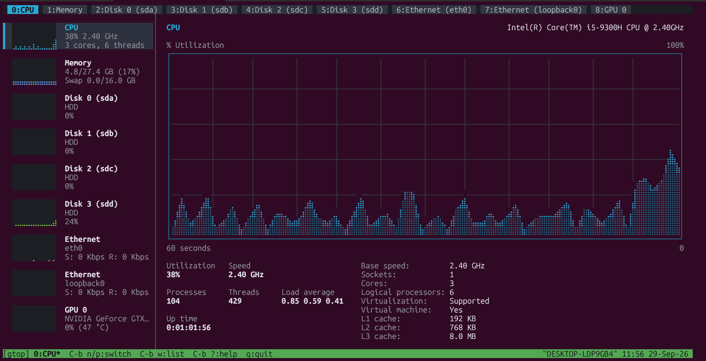

# wtop

[](https://github.com/tomjnet/wtop/actions/workflows/ci.yml)
[](https://github.com/tomjnet/wtop/releases/latest)


**wtop** is the *Windows-style Task Manager* take on `top`: the **w** stands for
the Windows Task Manager look, and **top** for the classic Unix process
monitor it sits next to (`top`, `htop`, ...).

> **Platform: Linux.** This version of wtop runs on Linux only; it reads its
> data from `/proc` and `/sys`.

A Task Manager style system monitor for the Linux terminal, written in modern
C++20. The program itself uses only the standard library and POSIX/Linux
system interfaces: no ncurses and no third-party runtime dependencies.



**Install** (no root needed, see [Installation](#installation) for details):

```bash
curl -fsSL https://raw.githubusercontent.com/tomjnet/wtop/HEAD/install.sh | bash
```

Like the *Performance* page of the Windows Task Manager, wtop shows one screen
per resource, each with a 60-second history graph and a statistics panel:

| Screen      | Graph(s)                                  | Statistics                                                                                   |
|-------------|-------------------------------------------|----------------------------------------------------------------------------------------------|
| **CPU**     | % utilization                             | Utilization, speed, processes, threads, load average, up time, sockets, cores, caches       |
| **Memory**  | Memory usage + composition bar            | In use, available, committed, cached, slab, buffers, shared, swap                           |
| **Disk N**  | Active time, transfer rate (read / write) | Active time, response time, read/write speed, capacity, formatted, system disk, swap, mounts |
| **Network** | Throughput (receive / send)               | Send/receive rates, link speed, IPv4/IPv6, MAC, Wi-Fi signal, totals                        |
| **GPU N**   | Utilization, dedicated memory             | Memory, temperature, clock, power, encoder/decoder, driver, PCI location                    |

Every screen is a tab. The tab line at the top works like an editor's buffer
list, a tmux-style status line and an htop-style function key bar sit at the
bottom, and tabs are switched with tmux-style `Ctrl+b` key bindings. On wide
terminals a Task Manager style sidebar lists every resource with a live mini
graph.

## Requirements

- **Linux** (reads `/proc` and `/sys`)
- A C++20 compiler (GCC 13+ or Clang 17+; `<format>` is required)
- CMake 3.20+
- A terminal with 24-bit color and UTF-8 (braille glyphs are used for graphs)
- Optional: `nvidia-smi` for NVIDIA GPUs; the `pci.ids` database
  (`hwdata` / `pciutils` package) for readable adapter and GPU names

See [Dependencies and versions](#dependencies-and-versions) for exact
versions.

## Installation

### Quick install (recommended)

```bash
curl -fsSL https://raw.githubusercontent.com/tomjnet/wtop/HEAD/install.sh | bash
```

The installer does not need root and, by default, does not need a compiler
either. It:

1. checks that you are on Linux and detects your CPU architecture,
2. downloads the pre-built binary of the **latest release**
   (`wtop-linux-x86_64.tar.gz` or `wtop-linux-aarch64.tar.gz`) and its
   `SHA256SUMS`, and refuses to install anything whose checksum does not match,
3. installs `wtop` into `~/.local/bin` and its man page into
   `~/.local/share/man/man1`,
4. runs the installed binary to verify it, removes the temporary files, and
   tells you if `~/.local/bin` still needs to be added to your `PATH`.

The release binaries are fully static, so they run on any Linux distribution
(glibc or musl) of that architecture. When no pre-built binary fits (another
CPU architecture, a branch instead of a release, or no release published yet),
the installer falls back to building from source: it checks for git, CMake
3.20+, make or ninja and a C++20 compiler with `<format>` (GCC 13+ /
Clang 17+), prints the package manager command for your distribution if
something is missing, then clones, builds and installs.

If you prefer to read a script before running it (a good habit):

```bash
curl -fsSLO https://raw.githubusercontent.com/tomjnet/wtop/HEAD/install.sh
less install.sh
bash install.sh
```

Installer options (pass them after `bash -s --` when piping):

```bash
curl -fsSL https://raw.githubusercontent.com/tomjnet/wtop/HEAD/install.sh | bash -s -- --ref v0.1.0
```

| Option           | Description                                                  |
|------------------|--------------------------------------------------------------|
| Option           | Description                                                          |
|------------------|----------------------------------------------------------------------|
| `--prefix DIR`   | Install under `DIR` instead of `~/.local`                            |
| `--ref REF`      | Release tag such as `v0.1.0` (default: latest release); a branch name builds from source |
| `--binary`       | Only install a pre-built binary, never build                         |
| `--from-source`  | Always clone and build from source                                   |
| `--repo URL`     | Git repository to clone                                              |
| `--source DIR`   | Build from an existing local checkout instead of cloning             |
| `--jobs N`       | Parallel build jobs (default: number of CPUs)                        |
| `--with-tests`   | Build from source and run the unit tests                             |
| `--check`        | Only check what is needed                                            |
| `--uninstall`    | Remove wtop from the prefix                                          |
| `--keep`         | Keep the temporary directory                                         |
| `--verbose`      | Show the full git, CMake and compiler output                         |

`WTOP_PREFIX`, `WTOP_REF` and `WTOP_REPO` set the same defaults from the
environment, `WTOP_RELEASES_URL` points the binary download at a mirror, and
`CXX` picks the compiler to try first.

To verify a release download yourself, check it against `SHA256SUMS` and the
signed build provenance published by GitHub Actions
(needs the [GitHub CLI](https://cli.github.com)):

```bash
sha256sum -c SHA256SUMS --ignore-missing
gh attestation verify wtop-linux-x86_64.tar.gz -R tomjnet/wtop
```

If `~/.local/bin` is not on your `PATH` yet, add it (then open a new
terminal) so that both `wtop` and `man wtop` are found:

```bash
echo 'export PATH="$HOME/.local/bin:$PATH"' >> ~/.bashrc
```

Upgrade by running the installer again. Uninstall with:

```bash
curl -fsSL https://raw.githubusercontent.com/tomjnet/wtop/HEAD/install.sh | bash -s -- --uninstall
```

### Build and install from source

Install the [requirements](#requirements) first, for example on Ubuntu 24.04 /
Debian 13:

```bash
sudo apt-get install -y git cmake g++ make
```

Clone and build:

```bash
git clone https://github.com/tomjnet/wtop.git
cd wtop
cmake -S . -B build -DCMAKE_BUILD_TYPE=Release
cmake --build build -j
```

Run the tests (built with GoogleTest, which CMake downloads on first configure
unless it is already installed; pass `-DWTOP_BUILD_TESTS=OFF` to skip them):

```bash
ctest --test-dir build --output-on-failure
```

Install for your user only, no root needed (`~/.local/bin` and
`~/.local/share/man`):

```bash
cmake --install build --prefix ~/.local --strip
```

Or system-wide into `/usr/local`:

```bash
sudo cmake --install build --strip
```

From a checkout, `./install.sh --source .` does all of the above (checks,
build, user install) in one step.

## Usage

```
wtop [options]

  -d, --delay <ms>       Refresh interval in milliseconds (default 1000, min 100)
  -t, --tab <n>          Tab to open first (0 = CPU, 1 = Memory, ...)
  -s, --snapshot [WxH]   Print every tab once as plain text and exit
  -h, --help             Show help and exit
  -v, --version          Show the version and license and exit
```

```bash
wtop --version     # version and license
wtop --help        # usage summary
man wtop           # full manual (installed by install.sh / cmake --install)
```

Before installing, read the manual straight from the build directory with
`man ./build/wtop.1`.

`--snapshot` is handy for scripts, bug reports, or checking what wtop sees
without starting the interactive UI.

### Key bindings

Function keys work like in htop, and are shown in the bar at the bottom of the
screen:

| Keys  | Action                   |
|-------|--------------------------|
| `F1`  | Show / hide key bindings |
| `F10` | Quit                     |

Tabs are switched tmux-style: press the prefix `Ctrl+b`, release, then press a
command key. While the prefix is pending the status line shows `^B`.

| Keys                   | Action                                    |
|------------------------|-------------------------------------------|
| `C-b n`                | Next tab                                  |
| `C-b p`                | Previous tab                              |
| `C-b ←` / `→`          | Previous / next tab                       |
| `C-b 0` … `9`          | Go to tab by number                       |
| `C-b l`                | Last used tab                             |
| `C-b w`                | Choose a tab from a list (`j`/`k`, Enter) |
| `C-b ?`                | Show key bindings                         |
| `C-b d`, `q`, `Ctrl+c` | Quit                                      |

## Where the numbers come from

| Resource | Source                                                                                      |
|----------|---------------------------------------------------------------------------------------------|
| CPU      | `/proc/stat` (utilization), `/proc/cpuinfo`, `/sys/devices/system/cpu` (frequency, caches, topology), `/proc/loadavg`, `/proc/uptime` |
| Memory   | `/proc/meminfo`                                                                             |
| Disk     | `/proc/diskstats`, `/sys/block`, `/proc/mounts` + `statvfs()`, `/proc/swaps`                |
| Network  | `/proc/net/dev`, `/sys/class/net`, `getifaddrs()`, `/proc/net/wireless`                     |
| GPU      | `nvidia-smi` (queried on a background thread) or `/sys/class/drm` for amdgpu / i915 / xe    |

A few Task Manager fields map to their closest Linux equivalents: *Handles*
becomes the load average, *Paged / Non-paged pool* become reclaimable /
unreclaimable slab memory, *Page file* becomes swap, and *Committed* is
`Committed_AS` against RAM + swap.

## Project layout

```
src/
  main.cc                 Command line parsing (--help, --version, ...)
  app.{h,cc}              Event loop, tabs, htop / tmux-style key handling
  core/                   Ring buffer, formatting, file helpers, pci.ids lookup
  collectors/             One collector per resource + pure /proc parsers
  terminal/               Raw mode, key decoding, diffing screen buffer
  ui/                     Widgets (braille graphs), tab bar, status line,
                          function key bar, sidebar, overlays, and the
                          shared performance pane
  ui/views/               One view per resource, turning collector data into
                          pane content
docs/wtop.1.in            Man page template (version filled in by CMake)
install.sh                One-line installer: release binary, or source build
.github/workflows/        ci.yml (build, test, lint) and release.yml (binaries)
CHANGELOG.md              Release history; the release notes come from here
tests/                    GoogleTest unit tests
screenshot/               Screenshots used in this README
```

The code follows the [Google C++ Style Guide](https://google.github.io/styleguide/cppguide.html);
format with `clang-format` using the bundled `.clang-format`.

## Contributing

Contributions are welcome. Please read [CONTRIBUTING.md](CONTRIBUTING.md) for
the development setup, coding style and pull request checklist.

## License

wtop is released under the [MIT License](LICENSE.md).

## Dependencies and versions

The `wtop` binary links only against the C++ standard library and the
operating system. Everything else below is a build tool, a test framework, or
an optional runtime data source. "Tested with" lists the versions wtop was
developed and verified against (Ubuntu 24.04).

| Dependency | Role | Required version | Tested with | Website |
|------------|------|------------------|-------------|---------|
| Linux kernel (`/proc`, `/sys`) | Data source | Any modern kernel | 6.18 | <https://www.kernel.org> |
| C++20 standard library | Only runtime library | C++20 with `<format>` | libstdc++ (GCC 13.3) | <https://gcc.gnu.org/onlinedocs/libstdc++/> |
| GCC | Compiler | 13+ | 13.3.0 | <https://gcc.gnu.org> |
| Clang (alternative) | Compiler | 17+ | — | <https://clang.llvm.org> |
| CMake | Build system | 3.20+ | 3.28.3 | <https://cmake.org> |
| Ninja or GNU Make | Build tool | Any | Ninja 1.11.1 | <https://ninja-build.org> · <https://www.gnu.org/software/make/> |
| Git | Used by `install.sh` to clone | Any | 2.43.0 | <https://git-scm.com> |
| GoogleTest | Unit tests only | 1.14+ (fetches 1.17.0) | 1.17.0 | <https://github.com/google/googletest> |
| Alpine Linux + musl | Builds the static release binaries (CI) | — | Alpine 3.24 | <https://alpinelinux.org> · <https://musl.libc.org> |
| GitHub Actions | CI and releases | — | checkout v7, upload-artifact v7, download-artifact v8, attest-build-provenance v4 | <https://docs.github.com/actions> |
| ShellCheck | Lints `install.sh` (CI) | — | 0.11.0 | <https://www.shellcheck.net> |
| actionlint | Lints the workflows | — | 1.7.12 | <https://github.com/rhysd/actionlint> |
| nvidia-smi | Optional: NVIDIA GPU data | Any | 615.71 | <https://developer.nvidia.com/system-management-interface> |
| pci.ids database | Optional: readable device names | Any | From `pciutils` / `hwdata` | <https://pci-ids.ucw.cz> |
| man-db | Optional: `man wtop` | Any | 2.12.0 | <https://man-db.gitlab.io/man-db/> |
| clang-format | Development: formatting | Any recent | 22.1.7 | <https://clang.llvm.org/docs/ClangFormat.html> |
| Google C++ Style Guide | Coding style | — | — | <https://google.github.io/styleguide/cppguide.html> |

## Author

Tom J.
